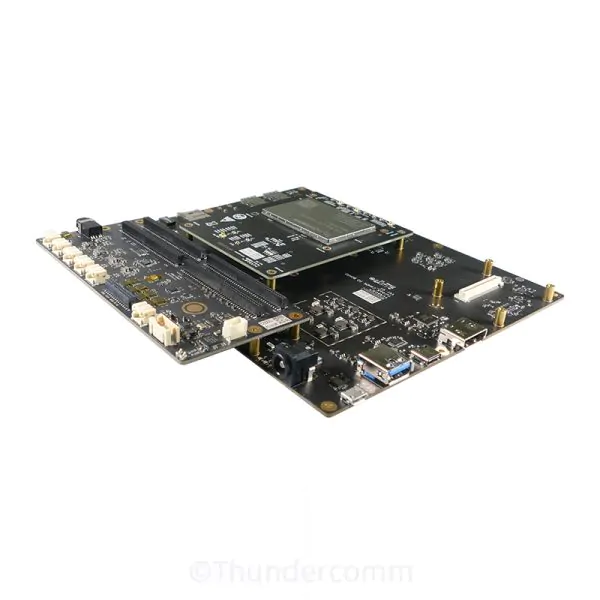
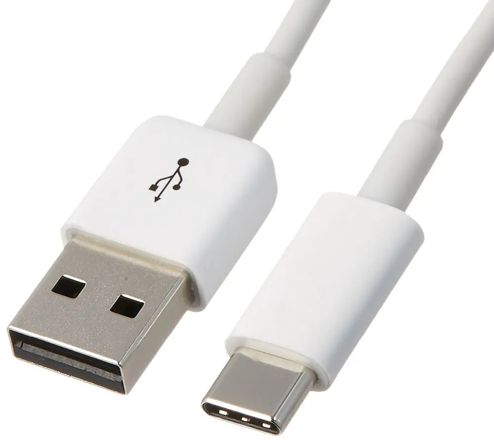
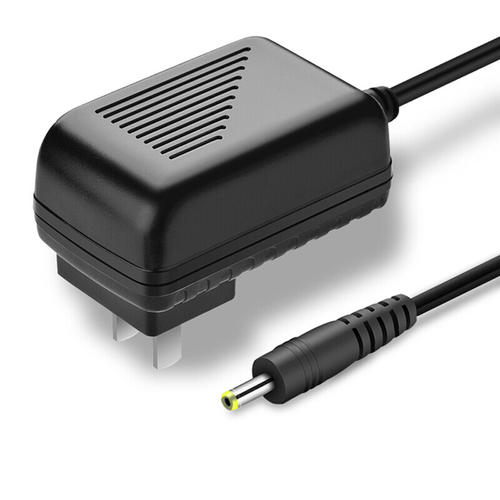

# Qualcomm® CM2290 Open Kit WifiLed-demo Developer documentation

## Introduce

This project relies on CM2290 development kit, and realizes the switch of LED lights controlled by WIFI in LAN by the powerful connection and communication ability of development kit. The onboard wifi is used as wifi AP. After the wifi is connected, the mobile phone accesses the WebUI and transmits communication messages through MQTT to control the onboard LED lights.

With the increasingly extensive application of the Internet of Things, more and more household appliances can be managed and controlled in the cloud. As a lazy person, I want to use my mobile phone to control the light on and off, instead of going to press the switch.

The project was built in x86 host with across complier tool and has been tested in Qualcomm® CM2290 Open Kits.

<center>Qualcomm® CM2290 Open Kits</center>



## Materials and Tools used for the project

1. Hardware materials

Except for the Open Kits,The following hardware materials are also needed:

* Type-C usb line

using the usb line to develop on Qualcomm® CM2290 Open Kits.



* Charger

Direct power supply for Qualcomm® CM2290 Open Kits.



## Environment configuration and development dependencies

This section mainly describes the source and configuration of some open source projects or third-party tools needed in the development process.

### mosquitto MQTT
Eclipse Mosquitto is an open source (EPL/EDL licensed) message broker that implements the MQTT protocol versions 5.0, 3.1.1 and 3.1. Mosquitto is lightweight and is suitable for use on all devices from low power single board computers to full servers.

From: [Eclipse Mosquitto](https://mosquitto.org/)<br>
version: 1.6.10

### libwebsockets
Libwebsockets (LWS) is a flexible, lightweight pure C library for implementing modern network protocols easily with a tiny footprint, using a nonblocking event loop. It has been developed continuously since 2010 and is used in tens of millions of devices and by thousands of developers around the world.

From: [libwebsockets](https://libwebsockets.org/)<br>
version: 4.0.1

### hivemq(only use Web UI)
HiveMQ's MQTT broker makes it easy to move data to and from connected devices in an efficient, fast and reliable manner. We make it possible to build connected products that enable new digital businesses.

From: [hivemq](https://www.hivemq.com/)

Download all codes and resources of Web UI.Then,push it to Qualcomm® CM2290 device`s dir /data/mqtt/web_client.

## Compile and build

The compilation of the whole project is based on the yocto compilation tool, so you need to write some .bb and .conf files according to the specification. The link is [wifi_led_0.1.bb](https://github.com/ThunderSoft-XA/C610-FaceMaskDetect-demo/blob/master/CM2290-WifiLed-demo/wifi_led_0.1.bb) example.

Please refer to [the official Manual of Yocto](https://www.yoctoproject.org) for how to add layers,write layer.conf .Then,excute the command as follows:

```
bitbake wifi_led
or
bitbake -b wifi_led_0.1.bb
```

you will get a  executable bin file named mqtt-led-client.Move it to the root of the source code.Next,push the whole project code to Qualcomm® CM2290 device`s dir /data/mqtt.

```
adb root && adb disable-verity && adb reboot

adb root &&adb remount && adb shell mount -o remount,rw /

adb push xxx/xxx/mqtt-led-client /data/mqtt
```

## Configure and Usage
### 1. Configure
Configure Wifi AP and MQTT broker by command line tool hostapd,udhcpd,ifconfig,mosquitto.
#### 1.1 Wifi AP
```
# ifconfig wlan0 192.168.0.1 netmask 255.255.255.0
# hostapd -B /etc/hostapd.conf -f /var/log/hstap.log
# udhcpd -f /etc/udhcpd.conf &
```

#### 1.2 MQTT broker
```
# mosquitto -c /etc/mosquitto/mosquitto.conf -d
```

Note: The source code contains these files, you can push them to the specified path.


### 2. Usage
#### 2.1 Mobile phone connected to wifi
WIFI name: CM2290-AP
WIFI password: 12345678

#### 2.1 Enable mqtt-led-client on the dev kit
```
# ./mqtt-led-client -h 192.168.0.1 -p 1883

# ./mqtt-led-client -H
mqtt-led-client usage:
                     	 --host/-h = 127.0.0.1
                    	 --port/-p = 1883
                    	 --help/-H
```

#### 2.2 Mobile access Web UI to connect to MQTT broker
Access 192.128.0.1:8080 in browser
MQTT host: 192.168.0.1
MQTT port: 8080
MQTT topic: topic/LED
MQTT message: led on/led off

See doc directory for [WifiLed video](./doc/WifiLed.mp4) results.